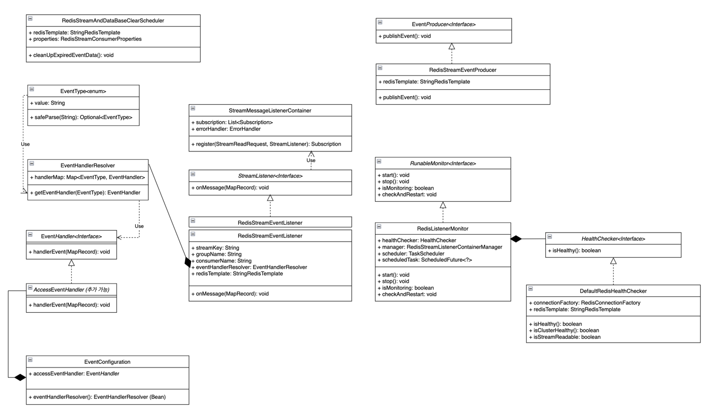

# Redis Streams를 활용한 이벤트 스트리밍 시스템

## 목차
- [개요](#개요)
- [기술 스택](#기술-스택)
- [패키지 구성](#패키지-구성)
- [클래스 다이어그램](#클래스-다이어그램)
- [구성 순서](#구성-순서)
    - [Docker 환경 구성](#1-docker를-활용하여-postgresql-및-redis-클러스터-구성)
    - [API 호출 - 이벤트 수집](#2-api-호출-시-url별로-이벤트를-redis-streams에-추가)
    - [Redis Stream Listener 처리](#3-eventlistener가-streams-메시지를-수신하여-별도로-처리)
    - [Redis 장애 복구 시스템](#4-redis-장애-시-원자적-예외-처리-및-모니터링-장애-복구-시스템)
    - [스케줄러 정리](#5-scheduler를-활용한-오래된-stream-message--pending-message--데이터베이스-이벤트-제거)
- [테스트 방법](#테스트-방법)

---

## 개요
본 토이 프로젝트는 Redis Streams를 이용하여 효율적인 효율적인 이벤트 수집 및 처리를 구현하는 것을 목표로 합니다.<p>
Redis Streams의 이해를 돕고, 실제 시스템 구축 경험을 통해 메시징 시스템 및 아키텍처 설계 능력을 향상시키는 데 중점을 둡니다.<p>
EventProducer는 발생하는 이벤트를 Redis Streams에 비동기적으로 추가하고, StreamMessageListenerContainer는 이를 실시간으로 수신하여 다양한 방식으로 이벤트를 처리하는 EventHandler를 호출합니다.<p>
이러한 구조는 다양한 이벤트 처리 요구사항에 대한 유연한 확장을 가능하게 합니다.<p>
더불어, Redis 클러스터의 예기치 않은 장애 발생 시 데이터의 무결성을 보장하기 위한 원자적 예외 처리 메커니즘과 시스템의 안정적인 운영을 위한 자동 복구 및 모니터링 기능을 포함하여 시스템의 안정성을 높였습니다.<p>


---

## 기술 스택

- Java 21
- Spring Boot 3.x
- Redis Streams (Cluster Mode) - redis:7.2
- PostgreSQL 14, Flyway
- Docker, Docker Compose
- Spring Data JPA
- Spring AOP, Scheduler

<br>

---

## 패키지 구성
```
event-system
├── event-docker                   # 도커 관련 설정
│   └── redis                        # Redis 설정 및 스크립트
└── event-listener                 # 이벤트 수집 및 처리 애플리케이션
    ├── event
    │   ├── core                     # 핵심 비즈니스 로직 계층
    │   │   ├── aop                  # AOP 기능 (예: 이벤트 관리)
    │   │   ├── common               # 공통 유틸리티
    │   │   ├── config               # 전역 설정 파일 및 구성 (예: Jackson)
    │   │   ├── domain               # 도메인 계층 (핵심 비즈니스 로직)
    │   │   │   └── access           # 액세스 관련 도메인
    │   │   │       ├── category     # 액세스 카테고리 관련 로직
    │   │   │       │   ├── entity   # 액세스 카테고리 엔티티 정의
    │   │   │       │   └── inout    # 액세스 카테고리 요청/응답 DTO
    │   │   │       ├── event          # 액세스 이벤트 관련 로직
    │   │   │       │   ├── entity   # 액세스 이벤트 엔티티 정의
    │   │   │       │   └── inout    # 액세스 이벤트 요청/응답 DTO
    │   │   │       └── summary      # 액세스 요약 데이터 로직
    │   │   └── exception            # 예외 처리 계층
    │   │       └── handler          # 글로벌 예외 핸들러
    │   └── infra                    # 인프라 계층 (외부 시스템과의 통합)
    │       ├── event
    │       │   ├── config           # 이벤트 설정 (예: EventHandler 설정)
    │       │   ├── handler          # 이벤트 핸들러 정의
    │       │   ├── listener         # 메시지 리스너 구현
    │       │   ├── monitoring       # 외부 연동 시스템 모니터링 (예: Redis 클러스터 모니터링)
    │       │   │   └── config       # 모니터링 관련 설정 파일
    │       │   ├── producer         # 메시지 프로듀서 (예: Redis Streams)
    │       │   └── redis            # Redis 기반 설정 및 로직
    │       │       ├── config       # Redis 연결 설정
    │       │       └── event        # Redis 이벤트 처리 (예: RedisErrorEvent)
    │       ├── scheduler            # 작업 스케줄러 구성
    │       └── util                 # 외부 공통 유틸리티 클래스
    └── resources                    # 설정 파일 및 리소스
        ├── config
        │   ├── dev                  # 개발 환경 설정
        │   └── prod                 # 운영 환경 설정
        └── db
            └── migration            # 데이터베이스 마이그레이션 파일 (예: Flyway)
```

<br>

---

## 클래스 다이어그램



<br>

---

## 구성 순서

### 1. Docker를 활용하여 PostgreSQL 및 Redis 클러스터 구성

- Docker Compose를 사용하여 PostgreSQL과 3개의 Redis 노드를 로컬에 구성합니다.
- redis-cluster-entry 노드를 통해 자동 클러스터 구성을 지원합니다.
- 자세한 설정은 [event-docker README 파일](evnet-docker/README.md) 참고.

### 2. API 호출 시 URL별로 이벤트를 Redis Streams에 추가

- 클라이언트 요청 발생 시 AOP로 URL 경로를 기준으로 이벤트를 구분합니다.
- EventProducer를 통해 Redis Streams(EVENT_STREAM)에 저장합니다
- 예시: `GET /admin/api/v1/event/access/summary/2025-05-04` 요청 → AOP → Redis 저장.

### 3. EventListener가 Streams 메시지를 수신하여 별도로 처리

- StreamMessageListenerContainer가 Redis Streams를 지속적으로 폴링합니다.
- 마지막으로 읽은 메시지 이후부터 처리하며, ack 처리도 지원합니다.
- EventHandler를 통해 이벤트 타입별 후속 작업을 유연하게 처리합니다.
- 기본 AccessEventHandler는 PostgreSQL 저장을 담당합니다.

### 4. Redis 장애 시 원자적 예외 처리 및 모니터링 장애 복구 시스템

- Redis 클러스터 장애를 감지하고 모니터링 시스템(`RedisListenerMonitor`)을 통해 자동 복구합니다.
- `CriticalRedisError` 발생 시 Listener를 중지하고, 복구되면 다시 시작합니다.

### 5. Scheduler를 활용한 오래된 Stream Message & Pending Message & 데이터베이스 이벤트 제거

- RedisStreamAndDataBaseClearScheduler가 주기적으로 Redis Streams 및 PostgreSQL 오래된 이벤트를 정리합니다.
- 기본 주기: 매일 오전 10시, 60일 이상 된 데이터 제거 (설정 가능).

<br>

---

## 테스트 방법

### git 리포지토리 클론
```shell
git clone https://github.com/ljh468/event-system.git
```

### 1. Docker Compose로 Redis 클러스터 및 PostgreSQL 구성
- [event-docker README 파일 확인](event-docker/README.md)

```shell
# docker-compose 실행
cd event-docker
docker-compose up -d

# 로컬 환경 구성시 /etc/hosts에 cluster-announce-ip 추가 필요

## 자동 스크립트 추가 (1, 2번이 수행됨)
./update-hosts.sh 2번 실행
## 아래의 작업이 수행됩니다.
- 1. chmod +x update-hosts.sh # 실행 권한을 부여
- 2. ENTRY="127.0.0.1 redis-node-1 redis-node-2 redis-node-3" # cluster-announce-ip를 binding 
```

### 2. Redis 클러스터 정상 구성 확인

```shell
docker exec -it redis-node-1 redis-cli -p 7001
AUTH root root
CLUSTER NODES
```

### 3. event-listener 애플리케이션 실행

```shell
./gradlew :event-listener:bootRun
```

### 4. API 호출하여 Redis Streams에 이벤트 추가

```shell
# API 호출 예시

## 날짜별 AccessCategory로 그룹화된 이벤트기록 요약 API 호출
curl -X GET http://localhost:47170/admin/api/v1/event/access/summary/2025-04-27

## AccessCategory 조회 API 호출
curl -X GET http://localhost:47170/admin/api/v1/event/access/categories
```

### 5. Listener가 Stream 이벤트를 수신하고, PostgreSQL에 정상적으로 저장되었는지 확인

```bash
# PostgreSQL 접속
docker exec -it postgres-db psql -U postgres -d event-system

# 접근 이벤트 테이블 조회
SELECT * FROM access_event ORDER BY created_at DESC;
```

### 6. Redis 노드 1개를 중지하여 장애 시뮬레이션

```bash
docker stop redis-node-2
```

### 7. 장애 상황 발생 시, 장애 복구 시스템이 동작하는지 확인 (RedisListenerMonitor)
- 10초 간격으로 모니터링하며 장애 감지 및 복구가 자동으로 수행 
- 장애가 난 노드는 이벤트를 통해 확인 가능

```java
INFO --- [taskScheduler-1] c.l.i.l.m.DefaultRedisHealthChecker      : redis cluster state: fail
INFO --- [taskScheduler-1] c.l.i.l.monitoring.RedisListenerMonitor  : Redis health check result: false
WARN --- [taskScheduler-1] c.l.i.l.monitoring.RedisListenerMonitor  : Redis is still unhealthy. Will retry...
INFO --- [xecutorLoop-3-8] i.l.core.protocol.ConnectionWatchdog     : Reconnecting, last destination was redis-node-2/<unresolved>:7002
```

### 8. Redis 장애가 복구되면, `StreamMessageListenerContainer`가 재시작되고 정상적으로 `Redis Streams`를 수신하는지 확인

```shell
docker start redis-node-2
```

```java
INFO --- [taskScheduler-1] c.l.i.l.m.DefaultRedisHealthChecker      : redis cluster state: ok
INFO --- [ioEventLoop-5-2] i.l.core.protocol.ReconnectionHandler    : Reconnected to redis-node-2/<unresolved>:7002
INFO --- [taskScheduler-1] c.l.i.l.m.DefaultRedisHealthChecker      : redis stream readable: true
INFO --- [taskScheduler-1] c.l.i.l.monitoring.RedisListenerMonitor  : Redis health check result: true
INFO --- [taskScheduler-1] c.l.i.l.monitoring.RedisListenerMonitor  : Redis is healthy. Restarting ListenerContainer and stopping monitor.
INFO --- [taskScheduler-1] .l.l.RedisStreamListenerContainerManager : Restarting Redis Listener Container...
INFO --- [taskScheduler-1] .l.l.RedisStreamListenerContainerManager : Redis Listener Container has been stopped.
INFO --- [taskScheduler-1] .l.l.RedisStreamListenerContainerManager : Redis Listener Container has started successfully.
INFO --- [taskScheduler-1] c.l.i.l.monitoring.RedisListenerMonitor  : Stopping redis listener health monitoring...
```
